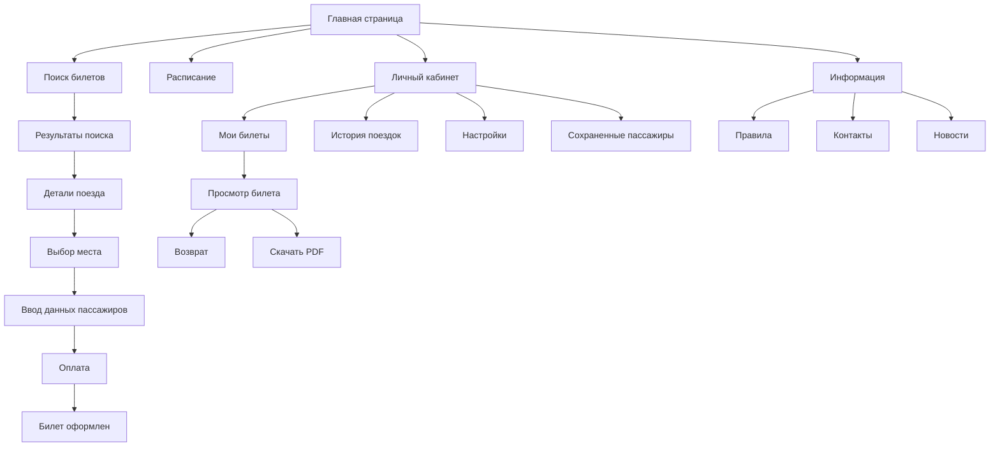

# 6. Разработать информационную архитектуру веб-приложения

## 6.1. Тип интерфейса и способы управления

### Тип интерфейса
Для системы электронных билетов выбран **гибридный тип интерфейса**, сочетающий элементы:
1.  **WIMP (Windows, Icons, Menus, Pointer)** - для десктопной веб-версии. Классический графический интерфейс с окнами, иконками, меню и управлением указателем.
2.  **Touch Interface (Сенсорный)** - для мобильного приложения и мобильной версии сайта. Ориентирован на управление пальцами, жесты (свайпы, тапы).
3.  **Адаптивный веб-интерфейс (Responsive Web Design)** - единый код для веб-версии, который подстраивается под размер экрана устройства (десктоп, планшет, смартфон).

### Способы управления
1.  **Мышь и клавиатура (Десктоп):**
    *   Точное позиционирование курсора.
    *   Использование горячих клавиш (особенно для кассиров).
    *   Ввод данных с физической клавиатуры.
    *   Наведение (Hover) для подсказок и интерактивных элементов.

2.  **Сенсорный экран (Мобильные устройства):**
    *   Тап (Tap) - выбор элемента.
    *   Свайп (Swipe) - прокрутка списков, переключение между экранами.
    *   Пинч (Pinch) - масштабирование схемы вагона.
    *   Долгое нажатие (Long press) - контекстное меню.

## 6.2. Карточная сортировка (Card Sorting)

Для разработки структуры была проведена симуляция **открытой карточной сортировки**.

### Исходные карточки (функции и контент)
*   Купить билет
*   Расписание поездов
*   Мои билеты
*   Возврат билета
*   Личные данные
*   История поездок
*   Схема вагона
*   Оплата
*   Контакты вокзала
*   Правила перевозки
*   Вход / Регистрация
*   Новости
*   Акции и скидки
*   Настройки уведомлений
*   Избранные маршруты

### Результаты сортировки (Группы)

**Группа 1: Поиск и покупка (Главная)**
*   Поиск рейса (Купить билет)
*   Расписание поездов
*   Схема вагона
*   Оплата

**Группа 2: Личный кабинет**
*   Мои билеты (Активные)
*   История поездок (Архив)
*   Личные данные (Профиль)
*   Избранные маршруты
*   Настройки уведомлений
*   Возврат билета

**Группа 3: Информация**
*   Правила перевозки
*   Новости
*   Акции и скидки
*   Контакты вокзала

**Группа 4: Системные**
*   Вход
*   Регистрация
*   Выход

## 6.3. Концептуальная схема (Карта сайта)

## 6.4. Словарь (Глоссарий)

| Термин | Определение |
| :--- | :--- |
| **Электронный билет** | Цифровой документ, подтверждающий договор перевозки пассажира, содержащий уникальный идентификатор и QR-код. |
| **QR-код** | Двумерный штрихкод на билете, используемый проводником для проверки валидности билета с помощью сканера. |
| **Схема вагона** | Графическое представление расположения мест в вагоне с цветовой индикацией их статуса (свободно/занято). |
| **Маршрут** | Путь следования поезда от станции отправления до станции назначения, включая промежуточные остановки. |
| **ЕРИП** | Система "Расчет" (Единое Расчетное и Информационное Пространство) - платежная система РБ для оплаты услуг. |
| **Личный кабинет** | Персональный раздел пользователя, где хранятся его данные, история поездок и настройки. |
| **Валидация** | Проверка введенных пользователем данных на корректность (формат email, наличие обязательных полей). |
