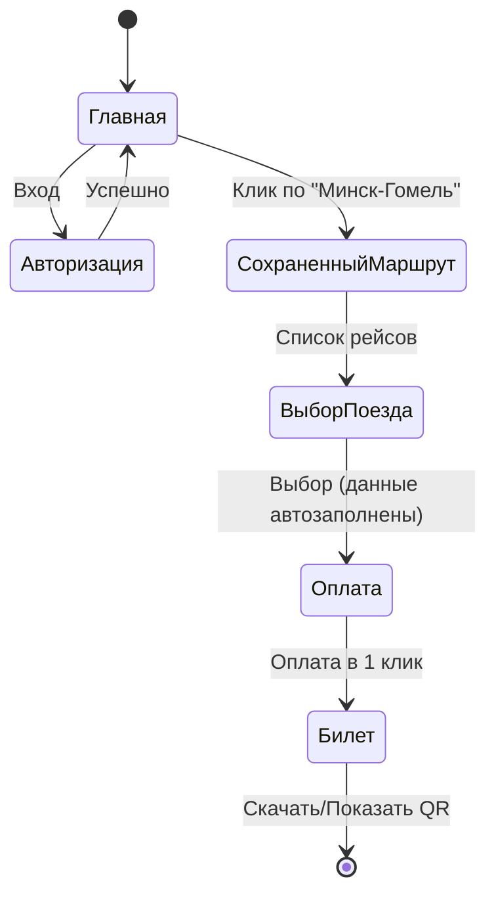
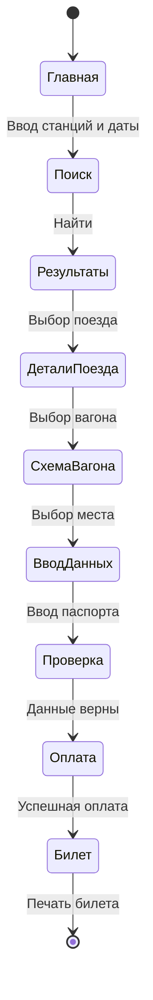
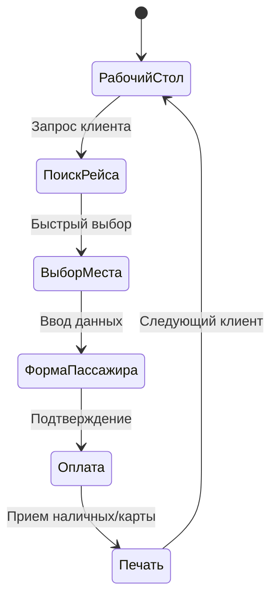
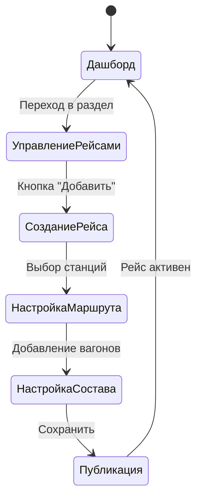

# 8. Навигационная модель системы

## 8.1. Навигационные модели персонажей

### 1. Анна Петрова (Частый пассажир)
**Цель:** Купить билет за минимальное время, используя сохраненные данные.



### 2. Владимир Иванович (Редкий пассажир)
**Цель:** Найти рейс и купить билет, внимательно проверяя каждый шаг.



### 3. Ольга Сергеевна (Кассир)
**Цель:** Быстро оформить билет для клиента в очереди.



### 4. Дмитрий Александрович (Администратор)
**Цель:** Добавить новый рейс в расписание.



## 8.2. Общая диаграмма путей (General Path Diagram)

Диаграмма объединяет все основные потоки пользователей в единую систему навигации.

```mermaid
graph TD
    %% Nodes
    Start((Старт))
    Home[Главная страница]
    Login[Авторизация / Регистрация]
    Profile[Личный кабинет]
    Search[Поиск рейсов]
    Results[Результаты поиска]
    Details[Детали поезда / Вагоны]
    Seat[Выбор места]
    Passenger[Ввод данных пассажира]
    Payment[Оплата]
    Ticket[Билет / Заказ]
    Admin[Админ-панель]
    ManageRoutes[Управление рейсами]
    ManageOrders[Управление заказами]

    %% Edges
    Start --> Home
    Home --> Login
    Home --> Search
    Home --> Profile
    
    Login --> Home
    Login --> Admin: Если роль = Админ
    
    Admin --> ManageRoutes
    Admin --> ManageOrders
    
    Profile --> Ticket: История поездок
    
    Search --> Results
    Results --> Details
    Details --> Seat
    Seat --> Passenger
    
    Passenger --> Payment
    Payment --> Ticket
    
    Ticket --> Home: На главную
    Ticket --> Profile: В историю
```
