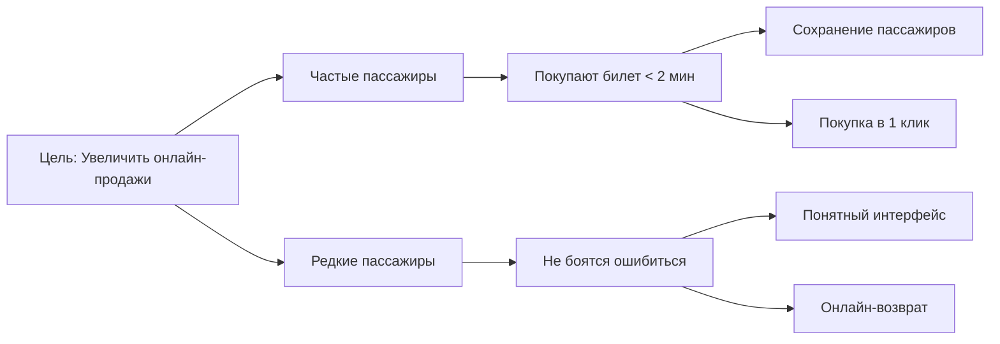
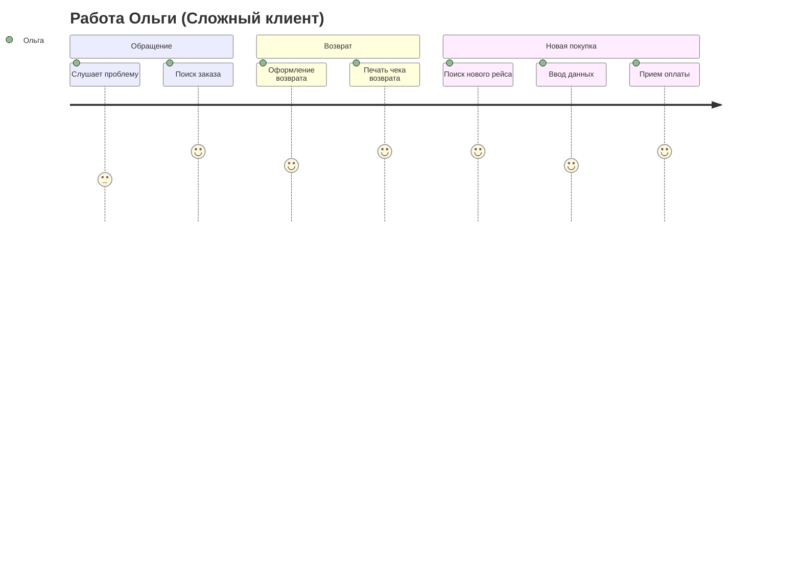
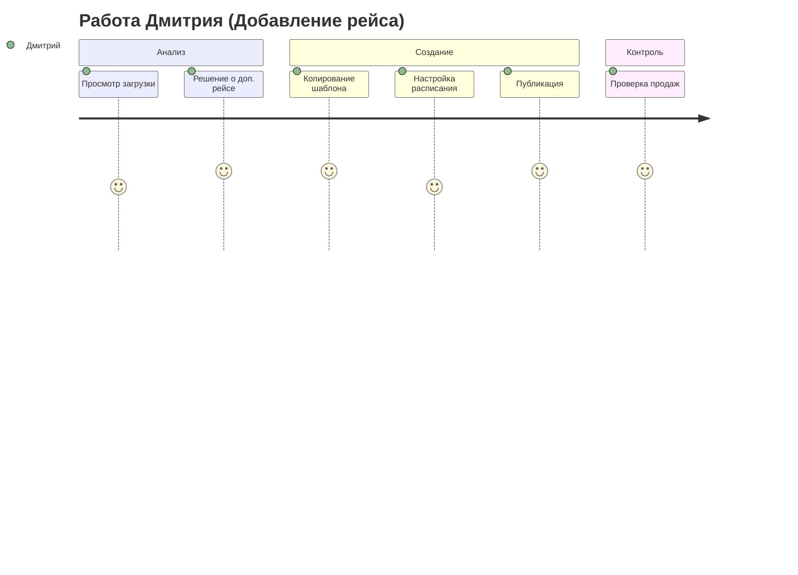

# 9. Карта пути клиента (CJM) и Карта влияния (Impact Map)

## 9.1. Карта влияния (Impact Map)

Карта влияния помогает связать бизнес-цели с функциональностью продукта.

**Бизнес-цель:** Увеличить долю онлайн-продаж билетов до 60% за 1 год (снизив нагрузку на кассы).



### Журнал ожиданий (User Stories)
1.  **Как** частый пассажир, **я хочу** сохранять данные своих попутчиков, **чтобы** не вводить их каждый раз вручную.
2.  **Как** частый пассажир, **я хочу** повторять прошлые поездки в один клик, **чтобы** экономить время.
3.  **Как** редкий пассажир, **я хочу** видеть схему вагона, **чтобы** выбрать удобное место у окна.
4.  **Как** редкий пассажир, **я хочу** иметь возможность вернуть билет онлайн, **чтобы** не ехать на вокзал в случае отмены поездки.

## 9.2. Карта пути клиента (Customer Journey Map)

**Персонаж:** Анна Петрова (Частый пассажир)
**Сценарий:** Покупка билета на поезд Минск-Гомель в пятницу вечером (час пик).

| Этап | Осознание (Awareness) | Рассмотрение (Consideration) | Покупка (Purchase) | Поездка (Experience) | Лояльность (Loyalty) |
| :--- | :--- | :--- | :--- | :--- | :--- |
| **Действия** | Вспоминает, что нужно ехать к родителям. Открывает приложение. | Выбирает маршрут из "Избранного". Смотрит время отправления. | Выбирает место. Оплачивает сохраненной картой. | Приходит на вокзал. Показывает QR-код проводнику. | Получает бонусы. Рекомендует приложение коллегам. |
| **Мысли** | "Надо успеть купить, пока не разобрали места." | "Так, 18:30 подходит. Есть ли места в плацкарте?" | "О, данные подтянулись. Отлично. Оплатить." | "Где мой вагон? А, вот номер в приложении." | "Удобно, не надо стоять в очереди." |
| **Эмоции** | 😟 Тревога (вдруг нет мест) | 😐 Сосредоточенность | 🙂 Облегчение (быстро) | 😎 Уверенность | 😍 Удовлетворение |
| **Точки контакта** | Push-уведомление (напоминание) | Экран "Избранное", Список рейсов | Схема вагона, Экран оплаты | Экран билета (QR), Проводник | Программа лояльности |
| **Барьеры** | Приложение долго грузится | Непонятно, какое место нижнее | Ошибка оплаты банком | Сканер проводника не считывает QR | Бонусы долго начисляются |
| **Решения** | Оптимизация скорости загрузки | Четкие иконки мест | Поддержка Apple Pay / Google Pay | Яркость экрана на макс. автоматически | Моментальное начисление |

### Визуализация CJM

```mermaid
journey
    title Путешествие Анны (Покупка билета)
    section Осознание
      Вспомнила о поездке: 3: Анна
      Открыла приложение: 4: Анна
    section Покупка
      Выбрала маршрут: 5: Анна
      Выбрала место: 4: Анна
      Оплатила: 5: Анна
    section Поездка
      Пришла на вокзал: 4: Анна
      Показала QR: 5: Анна
      Села в поезд: 5: Анна

## 9.3. CJM: Владимир Иванович (Редкий пассажир)
**Сценарий:** Покупка билета на сайте с помощью внука по телефону.

```mermaid
journey
    title Путешествие Владимира (Покупка с помощью)
    section Поиск
      Звонок внуку: 3: Владимир
      Открытие сайта: 2: Владимир
      Поиск рейса: 3: Владимир
    section Оформление
      Выбор места (схема): 4: Владимир
      Ввод паспорта (медленно): 2: Владимир
      Проверка данных: 4: Владимир
    section Оплата
      Ввод карты: 3: Владимир
      Получение SMS: 4: Владимир
      Печать билета: 5: Владимир
```

## 9.4. CJM: Ольга Сергеевна (Кассир)
**Сценарий:** Обслуживание сложного клиента (возврат и новая покупка).



## 9.5. CJM: Дмитрий Александрович (Администратор)
**Сценарий:** Добавление дополнительного поезда на праздники.


```
