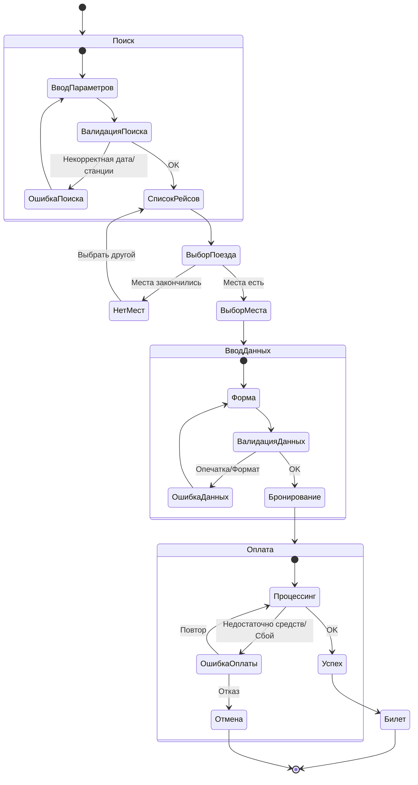

# 10. Интерактивные раскадровки и совокупная диаграмма

## 10.1. Ключевые сценарии (Интерактивные раскадровки)

### Сценарий 1: Анна (Частый пассажир) - "Повторная покупка"
1.  **Главная:** Видит виджет "Последние маршруты". Нажимает "Минск -> Гомель".
2.  **Результаты:** Список поездов отфильтрован (только скорые). Выбирает первый.
3.  **Вагон:** Система помнит предпочтение "Вагон 5, место у окна". Предлагает место 15. Анна подтверждает.
4.  **Данные:** "Пассажир: Анна Петрова" подставлен.
5.  **Оплата:** Apple Pay.
6.  **Финал:** Билет в приложении.

### Сценарий 2: Владимир Иванович (Редкий пассажир) - "Поиск с помощью"
1.  **Главная:** Нажимает "Купить билет" (большая кнопка).
2.  **Поиск:** Вводит "Минск", "Брест". Выбирает дату в календаре.
3.  **Результаты:** Видит список. Нажимает "Подробнее" у поезда.
4.  **Вагон:** Открывается схема. Выбирает нижнее место.
5.  **Ввод:** Медленно вводит паспорт. Система подсказывает формат.
6.  **Оплата:** Вводит карту. Подтверждает SMS.
7.  **Финал:** Кнопка "Распечатать билет".

### Сценарий 3: Ольга Сергеевна (Кассир) - "Продажа в час пик"
1.  **Поиск:** `Alt+F` -> "Гомель". `Enter`.
2.  **Выбор:** `Down` -> `Enter` (ближайший поезд).
3.  **Место:** `Alt+1` (автовыбор первого свободного нижнего).
4.  **Пассажир:** Сканирует паспорт (данные залетают в форму).
5.  **Оплата:** "Наличные". Печать чека.

### Сценарий 4: Дмитрий Александрович (Администратор) - "Добавление рейса"
1.  **Дашборд:** Видит красную зону загрузки на 30 декабря.
2.  **Действие:** Нажимает "Добавить рейс".
3.  **Настройка:** Выбирает шаблон "Скоростной Минск-Брест".
4.  **Время:** Устанавливает отправление 19:00.
5.  **Состав:** Добавляет 2 дополнительных плацкартных вагона.
6.  **Публикация:** Нажимает "Опубликовать". Рейс появляется в поиске.

## 10.2. Проверочные сценарии (Validation Scenarios)

Эти сценарии проверяют обработку ошибок и нестандартных ситуаций.

1.  **Нет мест:** Пользователь выбирает поезд, но места закончились в момент выбора.
    *   *Реакция:* Сообщение "Места закончились. Показать похожие рейсы?"
2.  **Ошибка оплаты:** Банк отклонил транзакцию.
    *   *Реакция:* "Оплата не прошла. Попробуйте другую карту или повторите." (Бронь держится 15 мин).
3.  **Неверные данные:** Ошибка в номере паспорта.
    *   *Реакция:* Поле подсвечивается красным, подсказка "Проверьте количество цифр".
4.  **Потеря связи:** Интернет пропал во время оформления.
    *   *Реакция:* "Нет сети. Данные сохранены локально. Повторяем соединение..."
5.  **Возврат:** Попытка вернуть билет за 10 минут до отправления.
    *   *Реакция:* "Возврат невозможен менее чем за час. Обратитесь в кассу."

## 10.3. Совокупная диаграмма взаимодействия

Диаграмма объединяет успешные пути и ветки ошибок.

