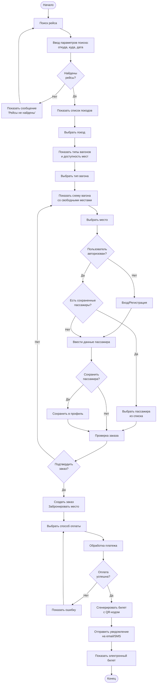
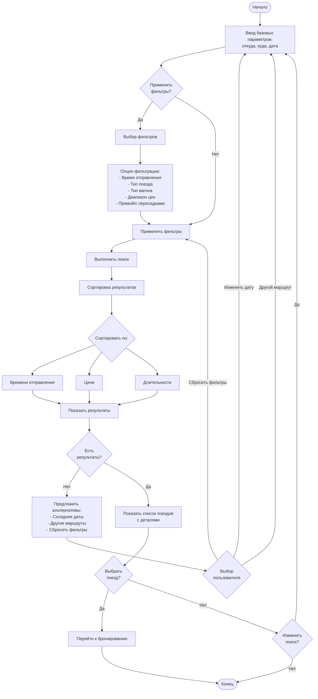
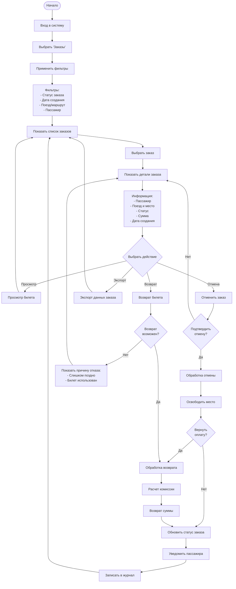
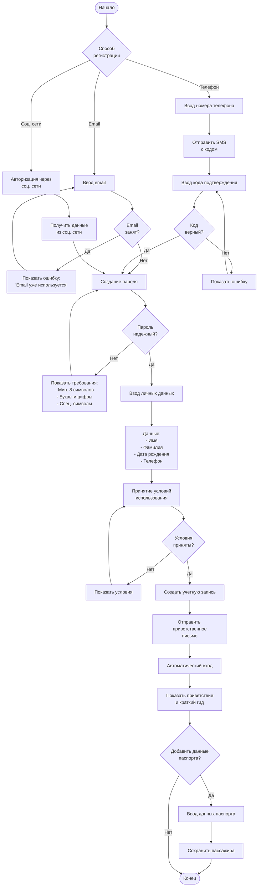
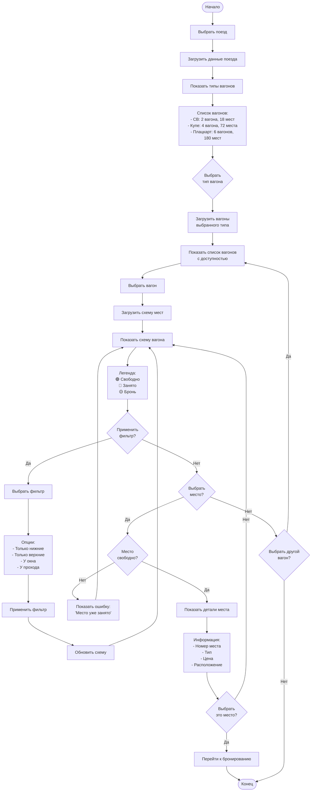

# Бизнес-процессы системы

## Введение

Документ описывает основные бизнес-процессы системы электронных билетов для ЖД-вокзала в Минске. Каждый процесс представлен в виде диаграммы и пошагового описания.

---

## 1. Процесс покупки билета (пассажир)

### Описание
Основной бизнес-процесс системы - покупка билета пассажиром через веб-сайт или мобильное приложение.

### Диаграмма процесса

### Пошаговое описание

1. **Поиск рейса**
   - Пользователь вводит параметры: станция отправления, станция прибытия, дата
   - Система выполняет поиск доступных поездов
   - Если рейсы не найдены - показывается сообщение с предложением изменить параметры

2. **Выбор поезда и места**
   - Система показывает список найденных поездов с информацией:
     - Время отправления и прибытия
     - Длительность поездки
     - Доступные типы вагонов и цены
     - Количество свободных мест
   - Пользователь выбирает поезд
   - Система показывает схему вагона со свободными местами
   - Пользователь выбирает конкретное место

3. **Авторизация и данные пассажира**
   - Если пользователь не авторизован - предлагается вход или регистрация
   - Если авторизован и есть сохраненные пассажиры - можно выбрать из списка
   - Иначе - ввод данных паспорта вручную
   - Опция сохранить пассажира для будущих покупок

4. **Подтверждение и оплата**
   - Система показывает итоговую информацию о заказе
   - Пользователь подтверждает заказ
   - Система бронирует место (на 15 минут)
   - Пользователь выбирает способ оплаты (карта, ЕРИП, Apple Pay и т.д.)
   - Обработка платежа

5. **Генерация билета**
   - При успешной оплате система генерирует электронный билет
   - Создается уникальный QR-код
   - Билет отправляется на email и доступен в приложении
   - Отправляется SMS-уведомление

### Исключительные ситуации

- **Места закончились во время оформления:** Уведомление пользователя, предложение выбрать другое место
- **Оплата отклонена:** Возможность повторить оплату другим способом, бронь сохраняется на 15 минут
- **Истекло время брони:** Место освобождается, нужно начать заново
- **Технический сбой:** Сохранение состояния заказа, возможность продолжить позже

---

## 2. Процесс поиска рейса по параметрам

### Описание
Расширенный поиск рейсов с фильтрацией и сортировкой.

### Диаграмма процесса

### Доступные фильтры

1. **Время отправления**
   - Утро (06:00-12:00)
   - День (12:00-18:00)
   - Вечер (18:00-00:00)
   - Ночь (00:00-06:00)

2. **Тип поезда**
   - Скорый
   - Пассажирский
   - Экспресс
   - Региональный

3. **Тип вагона**
   - СВ (спальный вагон)
   - Купе
   - Плацкарт
   - Общий

4. **Диапазон цен**
   - Минимальная цена
   - Максимальная цена

5. **Дополнительные опции**
   - Только прямые рейсы
   - С пересадками
   - Наличие мест у окна
   - Наличие нижних мест

### Варианты сортировки

- По времени отправления (раньше → позже)
- По цене (дешевле → дороже)
- По длительности (быстрее → медленнее)
- По наличию мест (больше → меньше)

---

## 3. Процесс добавления нового рейса (администратор)

### Описание
Администратор вокзала добавляет новый рейс в систему.

### Диаграмма процесса

```mermaid
flowchart TD
    Start([Начало]) --> Login[Вход в админ-панель]
    Login --> CheckPermissions{Есть права<br/>администратора?}
    CheckPermissions -->|Нет| AccessDenied[Доступ запрещен]
    AccessDenied --> End
    CheckPermissions -->|Да| SelectAction[Выбрать 'Добавить рейс']
    SelectAction --> EnterRouteInfo[Ввод информации о маршруте]
    EnterRouteInfo --> RouteDetails[Детали маршрута:<br/>- Номер маршрута<br/>- Станция отправления<br/>- Станция прибытия<br/>- Время отправления<br/>- Время прибытия]
    RouteDetails --> AddStops{Добавить<br/>остановки?}
    AddStops -->|Да| EnterStops[Ввод промежуточных остановок]
    EnterStops --> StopDetails[Для каждой остановки:<br/>- Станция<br/>- Время прибытия<br/>- Время отправления<br/>- Длительность стоянки]
    StopDetails --> MoreStops{Еще<br/>остановки?}
    MoreStops -->|Да| EnterStops
    MoreStops -->|Нет| ValidateRoute
    AddStops -->|Нет| ValidateRoute[Валидация маршрута]
    ValidateRoute --> RouteValid{Маршрут<br/>корректен?}
    RouteValid -->|Нет| ShowErrors[Показать ошибки]
    ShowErrors --> EnterRouteInfo
    RouteValid -->|Да| CreateTrain[Создать поезд на маршруте]
    CreateTrain --> EnterTrainInfo[Ввод информации о поезде:<br/>- Номер поезда<br/>- Тип поезда<br/>- Дата отправления]
    EnterTrainInfo --> AddCarriages[Добавление вагонов]
    AddCarriages --> CarriageDetails[Для каждого вагона:<br/>- Номер вагона<br/>- Тип вагона<br/>- Количество мест]
    CarriageDetails --> GenerateSeats[Автогенерация мест<br/>в вагоне]
    GenerateSeats --> SetPrices[Установка цен<br/>по типам вагонов]
    SetPrices --> MoreCarriages{Еще<br/>вагоны?}
    MoreCarriages -->|Да| AddCarriages
    MoreCarriages -->|Нет| ReviewAll[Проверка всей информации]
    ReviewAll --> ConfirmCreate{Подтвердить<br/>создание?}
    ConfirmCreate -->|Нет| SelectAction
    ConfirmCreate -->|Да| SaveToDatabase[Сохранить в БД]
    SaveToDatabase --> PublishRoute[Опубликовать рейс<br/>для продажи]
    PublishRoute --> SendNotifications[Уведомить систему<br/>о новом рейсе]
    SendNotifications --> LogAction[Записать в журнал действий]
    LogAction --> ShowSuccess[Показать сообщение<br/>'Рейс успешно добавлен']
    ShowSuccess --> End([Конец])
```

### Валидация данных

1. **Маршрут:**
   - Станция отправления ≠ станция прибытия
   - Время прибытия > время отправления
   - Промежуточные остановки в хронологическом порядке

2. **Поезд:**
   - Уникальный номер поезда на эту дату
   - Тип поезда из допустимых значений
   - Дата не в прошлом

3. **Вагоны:**
   - Уникальные номера вагонов в поезде
   - Количество мест соответствует типу вагона
   - Цены > 0

---

## 4. Процесс обработки заказов (кассир/администратор)

### Описание
Просмотр и обработка заказов пассажиров.

### Диаграмма процесса

### Статусы заказов

1. **Новый** - заказ создан, ожидает оплаты
2. **Оплачен** - оплата прошла успешно
3. **Отменен** - заказ отменен пользователем или системой
4. **Возвращен** - оплата возвращена
5. **Использован** - билет использован (поезд отправился)

### Правила возврата

| Время до отправления | Комиссия | Возврат возможен |
|---------------------|----------|------------------|
| > 24 часа | 0% | Да |
| 1-24 часа | 10% | Да |
| < 1 час | - | Нет |
| После отправления | - | Нет |

---

## 5. Процесс регистрации нового пассажира

### Описание
Регистрация нового пользователя в системе.

### Диаграмма процесса

### Требования к паролю

- Минимум 8 символов
- Хотя бы одна заглавная буква
- Хотя бы одна строчная буква
- Хотя бы одна цифра
- Рекомендуется специальный символ

### Способы регистрации

1. **Email + пароль** - классический способ
2. **Номер телефона + SMS** - быстрая регистрация
3. **Социальные сети** - Google, Facebook, VK

---

## 6. Процесс проверки свободных мест

### Описание
Проверка доступности мест в поезде.

### Диаграмма процесса

### Цветовая индикация мест

- 🟢 **Зеленый** - место свободно
- 🔴 **Красный** - место занято (билет куплен)
- 🟡 **Желтый** - место в брони (оформляется заказ)
- ⚪ **Серый** - место недоступно (служебное)

---

## Интеграции между процессами

### Связь процессов

1. **Покупка билета** → **Проверка мест** → **Обработка заказов**
2. **Поиск рейса** → **Покупка билета**
3. **Регистрация** → **Покупка билета**
4. **Добавление рейса** → **Поиск рейса** → **Покупка билета**

### Общие данные

- **База поездов** - используется в поиске, покупке, проверке мест
- **База пользователей** - регистрация, авторизация, покупка
- **База заказов** - покупка, обработка заказов, аналитика

---

## Метрики процессов

### KPI системы

1. **Время покупки билета** - цель < 3 минуты
2. **Конверсия поиск → покупка** - цель > 40%
3. **Процент успешных платежей** - цель > 95%
4. **Время обработки возврата** - цель < 5 минут
5. **Доступность системы** - цель > 99.5%

### Мониторинг

- Количество поисков в день
- Количество покупок в день
- Средний чек
- Популярные маршруты
- Пиковые часы нагрузки

---

## Выводы

Бизнес-процессы системы:
1. **Покрывают все требования** из задания
2. **Оптимизированы для пользователей** - минимум шагов, максимум удобства
3. **Учитывают исключительные ситуации** - обработка ошибок, откаты
4. **Масштабируемы** - легко добавить новые процессы
5. **Измеримы** - определены KPI для каждого процесса
