# Объектная модель системы

## Введение

Объектная модель описывает основные сущности системы электронных билетов для ЖД-вокзала, их атрибуты, методы и взаимосвязи. Модель разработана на основе анализа требований, профилей пользователей и контекстных сценариев.

## Диаграмма классов

```mermaid
classDiagram
    class User {
        +int id
        +string email
        +string password_hash
        +string phone
        +string first_name
        +string last_name
        +datetime created_at
        +datetime last_login
        +UserRole role
        +register()
        +login()
        +logout()
        +updateProfile()
        +resetPassword()
    }

    class Passenger {
        +int id
        +int user_id
        +string passport_series
        +string passport_number
        +string first_name
        +string last_name
        +string middle_name
        +date birth_date
        +string citizenship
        +addPassenger()
        +updatePassenger()
        +deletePassenger()
        +getPassengerInfo()
    }

    class Route {
        +int id
        +string route_number
        +Station departure_station
        +Station arrival_station
        +time departure_time
        +time arrival_time
        +int duration_minutes
        +bool is_active
        +addRoute()
        +updateRoute()
        +deleteRoute()
        +getRouteInfo()
        +getIntermediateStops()
    }

    class Station {
        +int id
        +string name
        +string code
        +string city
        +string address
        +float latitude
        +float longitude
        +addStation()
        +updateStation()
        +getStationInfo()
    }

    class IntermediateStop {
        +int id
        +int route_id
        +int station_id
        +int stop_order
        +time arrival_time
        +time departure_time
        +int stop_duration_minutes
        +addStop()
        +updateStop()
        +deleteStop()
    }

    class Train {
        +int id
        +string train_number
        +string train_type
        +int route_id
        +date travel_date
        +TrainStatus status
        +addTrain()
        +updateTrain()
        +cancelTrain()
        +getTrainInfo()
        +getAvailableSeats()
    }

    class Carriage {
        +int id
        +int train_id
        +int carriage_number
        +CarriageType type
        +int total_seats
        +int available_seats
        +addCarriage()
        +updateCarriage()
        +getSeats()
        +getAvailableSeats()
    }

    class Seat {
        +int id
        +int carriage_id
        +int seat_number
        +SeatType type
        +bool is_available
        +float price
        +reserveSeat()
        +releaseSeat()
        +getSeatInfo()
    }

    class Order {
        +int id
        +int user_id
        +datetime created_at
        +OrderStatus status
        +float total_price
        +PaymentMethod payment_method
        +datetime payment_date
        +createOrder()
        +updateStatus()
        +cancelOrder()
        +processPayment()
        +getOrderDetails()
    }

    class Ticket {
        +int id
        +int order_id
        +int passenger_id
        +int train_id
        +int seat_id
        +float price
        +string ticket_number
        +string qr_code
        +TicketStatus status
        +generateTicket()
        +cancelTicket()
        +refundTicket()
        +getTicketInfo()
        +downloadPDF()
    }

    class Payment {
        +int id
        +int order_id
        +float amount
        +PaymentMethod method
        +PaymentStatus status
        +datetime payment_date
        +string transaction_id
        +processPayment()
        +refundPayment()
        +getPaymentInfo()
    }

    class SearchQuery {
        +Station from_station
        +Station to_station
        +date travel_date
        +int passengers_count
        +CarriageType preferred_type
        +search()
        +applyFilters()
        +sortResults()
    }

    User "1" --> "*" Passenger : has
    User "1" --> "*" Order : creates
    Route "1" --> "1" Station : departure
    Route "1" --> "1" Station : arrival
    Route "1" --> "*" IntermediateStop : has
    IntermediateStop "*" --> "1" Station : stops at
    Train "*" --> "1" Route : follows
    Train "1" --> "*" Carriage : has
    Carriage "1" --> "*" Seat : contains
    Order "1" --> "*" Ticket : includes
    Ticket "*" --> "1" Passenger : for
    Ticket "*" --> "1" Train : on
    Ticket "*" --> "1" Seat : reserves
    Order "1" --> "1" Payment : has
```

## Описание основных классов

### 1. User (Пользователь)

**Описание:** Базовый класс для всех пользователей системы.

**Атрибуты:**
- `id` - уникальный идентификатор
- `email` - электронная почта (логин)
- `password_hash` - хэш пароля
- `phone` - номер телефона
- `first_name` - имя
- `last_name` - фамилия
- `created_at` - дата регистрации
- `last_login` - последний вход
- `role` - роль (пассажир, кассир, администратор)

**Методы:**
- `register()` - регистрация нового пользователя
- `login()` - вход в систему
- `logout()` - выход из системы
- `updateProfile()` - обновление профиля
- `resetPassword()` - сброс пароля

**Связи:**
- Один пользователь может иметь несколько сохраненных пассажиров
- Один пользователь может создавать множество заказов

---

### 2. Passenger (Пассажир)

**Описание:** Информация о пассажире для оформления билета.

**Атрибуты:**
- `id` - уникальный идентификатор
- `user_id` - ссылка на пользователя
- `passport_series` - серия паспорта
- `passport_number` - номер паспорта
- `first_name` - имя
- `last_name` - фамилия
- `middle_name` - отчество
- `birth_date` - дата рождения
- `citizenship` - гражданство

**Методы:**
- `addPassenger()` - добавление пассажира
- `updatePassenger()` - обновление данных
- `deletePassenger()` - удаление пассажира
- `getPassengerInfo()` - получение информации

**Связи:**
- Принадлежит одному пользователю
- Может иметь множество билетов

---

### 3. Station (Станция)

**Описание:** Железнодорожная станция.

**Атрибуты:**
- `id` - уникальный идентификатор
- `name` - название станции
- `code` - код станции
- `city` - город
- `address` - адрес
- `latitude` - широта
- `longitude` - долгота

**Методы:**
- `addStation()` - добавление станции
- `updateStation()` - обновление информации
- `getStationInfo()` - получение информации

**Связи:**
- Является начальной или конечной точкой маршрута
- Может быть промежуточной остановкой

---

### 4. Route (Маршрут)

**Описание:** Маршрут следования поезда.

**Атрибуты:**
- `id` - уникальный идентификатор
- `route_number` - номер маршрута
- `departure_station` - станция отправления
- `arrival_station` - станция прибытия
- `departure_time` - время отправления
- `arrival_time` - время прибытия
- `duration_minutes` - длительность в минутах
- `is_active` - активен ли маршрут

**Методы:**
- `addRoute()` - добавление маршрута
- `updateRoute()` - обновление маршрута
- `deleteRoute()` - удаление маршрута
- `getRouteInfo()` - получение информации
- `getIntermediateStops()` - получение промежуточных остановок

**Связи:**
- Имеет станцию отправления и прибытия
- Может иметь промежуточные остановки
- По маршруту следуют поезда

---

### 5. IntermediateStop (Промежуточная остановка)

**Описание:** Остановка на маршруте между начальной и конечной станциями.

**Атрибуты:**
- `id` - уникальный идентификатор
- `route_id` - ссылка на маршрут
- `station_id` - ссылка на станцию
- `stop_order` - порядковый номер остановки
- `arrival_time` - время прибытия
- `departure_time` - время отправления
- `stop_duration_minutes` - длительность остановки

**Методы:**
- `addStop()` - добавление остановки
- `updateStop()` - обновление остановки
- `deleteStop()` - удаление остановки

**Связи:**
- Принадлежит маршруту
- Связана со станцией

---

### 6. Train (Поезд)

**Описание:** Конкретный поезд на определенную дату.

**Атрибуты:**
- `id` - уникальный идентификатор
- `train_number` - номер поезда
- `train_type` - тип поезда (скорый, пассажирский, экспресс)
- `route_id` - ссылка на маршрут
- `travel_date` - дата отправления
- `status` - статус (запланирован, отправлен, прибыл, отменен)

**Методы:**
- `addTrain()` - добавление поезда
- `updateTrain()` - обновление информации
- `cancelTrain()` - отмена поезда
- `getTrainInfo()` - получение информации
- `getAvailableSeats()` - получение свободных мест

**Связи:**
- Следует по маршруту
- Имеет вагоны

---

### 7. Carriage (Вагон)

**Описание:** Вагон в составе поезда.

**Атрибуты:**
- `id` - уникальный идентификатор
- `train_id` - ссылка на поезд
- `carriage_number` - номер вагона
- `type` - тип вагона (СВ, купе, плацкарт, общий)
- `total_seats` - всего мест
- `available_seats` - свободных мест

**Методы:**
- `addCarriage()` - добавление вагона
- `updateCarriage()` - обновление информации
- `getSeats()` - получение всех мест
- `getAvailableSeats()` - получение свободных мест

**Связи:**
- Принадлежит поезду
- Содержит места

---

### 8. Seat (Место)

**Описание:** Место в вагоне.

**Атрибуты:**
- `id` - уникальный идентификатор
- `carriage_id` - ссылка на вагон
- `seat_number` - номер места
- `type` - тип места (верхнее, нижнее, боковое, у окна)
- `is_available` - доступно ли место
- `price` - цена

**Методы:**
- `reserveSeat()` - бронирование места
- `releaseSeat()` - освобождение места
- `getSeatInfo()` - получение информации

**Связи:**
- Принадлежит вагону
- Может быть забронировано билетом

---

### 9. Order (Заказ)

**Описание:** Заказ пользователя, может включать несколько билетов.

**Атрибуты:**
- `id` - уникальный идентификатор
- `user_id` - ссылка на пользователя
- `created_at` - дата создания
- `status` - статус (новый, оплачен, отменен, возвращен)
- `total_price` - общая стоимость
- `payment_method` - способ оплаты
- `payment_date` - дата оплаты

**Методы:**
- `createOrder()` - создание заказа
- `updateStatus()` - обновление статуса
- `cancelOrder()` - отмена заказа
- `processPayment()` - обработка оплаты
- `getOrderDetails()` - получение деталей заказа

**Связи:**
- Создается пользователем
- Включает билеты
- Имеет платеж

---

### 10. Ticket (Билет)

**Описание:** Электронный билет на поезд.

**Атрибуты:**
- `id` - уникальный идентификатор
- `order_id` - ссылка на заказ
- `passenger_id` - ссылка на пассажира
- `train_id` - ссылка на поезд
- `seat_id` - ссылка на место
- `price` - цена билета
- `ticket_number` - номер билета
- `qr_code` - QR-код для проверки
- `status` - статус (активен, использован, отменен, возвращен)

**Методы:**
- `generateTicket()` - генерация билета
- `cancelTicket()` - отмена билета
- `refundTicket()` - возврат билета
- `getTicketInfo()` - получение информации
- `downloadPDF()` - скачивание PDF

**Связи:**
- Принадлежит заказу
- Оформлен на пассажира
- Резервирует место в поезде

---

### 11. Payment (Платеж)

**Описание:** Платеж за заказ.

**Атрибуты:**
- `id` - уникальный идентификатор
- `order_id` - ссылка на заказ
- `amount` - сумма
- `method` - способ оплаты (карта, ЕРИП, наличные)
- `status` - статус (ожидает, успешно, отклонен, возвращен)
- `payment_date` - дата платежа
- `transaction_id` - ID транзакции

**Методы:**
- `processPayment()` - обработка платежа
- `refundPayment()` - возврат платежа
- `getPaymentInfo()` - получение информации

**Связи:**
- Связан с заказом

---

### 12. SearchQuery (Поисковый запрос)

**Описание:** Объект для поиска рейсов.

**Атрибуты:**
- `from_station` - станция отправления
- `to_station` - станция прибытия
- `travel_date` - дата поездки
- `passengers_count` - количество пассажиров
- `preferred_type` - предпочитаемый тип вагона

**Методы:**
- `search()` - выполнение поиска
- `applyFilters()` - применение фильтров
- `sortResults()` - сортировка результатов

---

## Перечисления (Enums)

### UserRole
- `PASSENGER` - пассажир
- `CASHIER` - кассир
- `STATION_ADMIN` - администратор вокзала
- `SYSTEM_ADMIN` - системный администратор

### TrainStatus
- `SCHEDULED` - запланирован
- `DEPARTED` - отправлен
- `ARRIVED` - прибыл
- `CANCELLED` - отменен
- `DELAYED` - задержан

### CarriageType
- `LUXURY` - СВ (спальный вагон)
- `COMPARTMENT` - купе
- `RESERVED` - плацкарт
- `GENERAL` - общий

### SeatType
- `LOWER` - нижнее
- `UPPER` - верхнее
- `SIDE_LOWER` - боковое нижнее
- `SIDE_UPPER` - боковое верхнее

### OrderStatus
- `NEW` - новый
- `PAID` - оплачен
- `CANCELLED` - отменен
- `REFUNDED` - возвращен

### TicketStatus
- `ACTIVE` - активен
- `USED` - использован
- `CANCELLED` - отменен
- `REFUNDED` - возвращен

### PaymentMethod
- `CARD` - банковская карта
- `ERIP` - ЕРИП
- `CASH` - наличные
- `APPLE_PAY` - Apple Pay
- `GOOGLE_PAY` - Google Pay

### PaymentStatus
- `PENDING` - ожидает
- `SUCCESS` - успешно
- `FAILED` - отклонен
- `REFUNDED` - возвращен

## Соответствие объектов персонажам

### Анна Петрова (Частый пассажир)

**Основные объекты:**
- `User` - ее учетная запись
- `Passenger` - сохраненные данные (она сама)
- `SearchQuery` - поиск любимого маршрута
- `Order` - заказы билетов
- `Ticket` - электронные билеты
- `Payment` - оплата картой

**Сценарий использования:**
1. Открывает приложение → работает с `User`
2. Выбирает сохраненный маршрут → `SearchQuery`
3. Видит список поездов → `Train`, `Route`
4. Выбирает место → `Carriage`, `Seat`
5. Данные подставляются автоматически → `Passenger`
6. Оплачивает → `Order`, `Payment`
7. Получает билет → `Ticket`

---

### Владимир Иванович (Редкий пассажир)

**Основные объекты:**
- `User` - учетная запись
- `Station` - выбор станций
- `SearchQuery` - поиск рейса
- `Train` - просмотр информации о поезде
- `Passenger` - ввод данных паспорта
- `Order` - оформление заказа
- `Ticket` - получение билета

**Сценарий использования:**
1. Регистрируется → `User.register()`
2. Ищет рейс → `SearchQuery.search()`
3. Выбирает поезд → `Train`
4. Выбирает место → `Seat`
5. Вводит данные → `Passenger.addPassenger()`
6. Оплачивает → `Payment.processPayment()`
7. Получает и печатает билет → `Ticket.downloadPDF()`

---

### Ольга Сергеевна (Кассир)

**Основные объекты:**
- `User` - рабочая учетная запись (роль CASHIER)
- `SearchQuery` - поиск рейсов для клиентов
- `Train` - информация о поездах
- `Seat` - проверка и бронирование мест
- `Passenger` - ввод данных клиентов
- `Order` - создание заказов
- `Payment` - прием оплаты
- `Ticket` - печать билетов

**Сценарий использования:**
1. Входит в систему → `User.login()`
2. Принимает запрос клиента → `SearchQuery`
3. Показывает варианты → `Train.getAvailableSeats()`
4. Выбирает место → `Seat.reserveSeat()`
5. Вводит данные клиента → `Passenger`
6. Создает заказ → `Order.createOrder()`
7. Принимает оплату → `Payment.processPayment()`
8. Печатает билет → `Ticket.generateTicket()`

---

### Дмитрий Александрович (Администратор вокзала)

**Основные объекты:**
- `User` - учетная запись (роль STATION_ADMIN)
- `Station` - управление станциями
- `Route` - управление маршрутами
- `IntermediateStop` - добавление остановок
- `Train` - добавление поездов
- `Carriage` - управление составом
- `Order` - просмотр статистики заказов

**Сценарий использования:**
1. Входит в админ-панель → `User.login()`
2. Добавляет новый маршрут → `Route.addRoute()`
3. Добавляет остановки → `IntermediateStop.addStop()`
4. Создает поезд → `Train.addTrain()`
5. Добавляет вагоны → `Carriage.addCarriage()`
6. Просматривает статистику → `Order.getOrderDetails()`

---

## Бизнес-правила

### Бронирование мест
1. Место может быть забронировано только если `Seat.is_available = true`
2. После бронирования `Seat.is_available` становится `false`
3. Если заказ не оплачен в течение 15 минут, бронь снимается

### Возврат билетов
1. Возврат возможен не позднее чем за 1 час до отправления
2. При возврате удерживается комиссия 10%
3. Возврат за 24+ часа - без комиссии
4. После возврата место освобождается: `Seat.is_available = true`

### Цены
1. Цена зависит от типа вагона и маршрута
2. Детям до 5 лет - бесплатно (без места)
3. Детям 5-10 лет - скидка 50%
4. Студентам - скидка 25% (по предъявлению студенческого)

### Поиск
1. Поиск показывает поезда на ±3 дня от выбранной даты
2. Результаты сортируются по времени отправления
3. Показываются только поезда со свободными местами

## Выводы

Объектная модель:
1. **Покрывает все сценарии** из требований
2. **Соответствует персонажам** - каждый персонаж работает с определенным набором объектов
3. **Масштабируема** - легко добавить новые типы вагонов, способы оплаты и т.д.
4. **Понятна** - четкие связи между объектами
5. **Реализуема** - может быть реализована в реляционной БД или NoSQL
