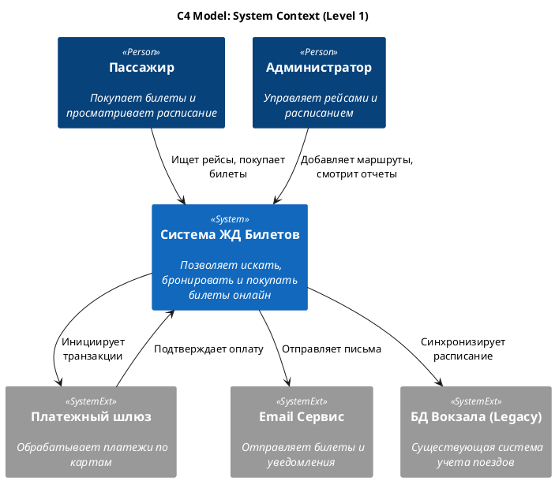
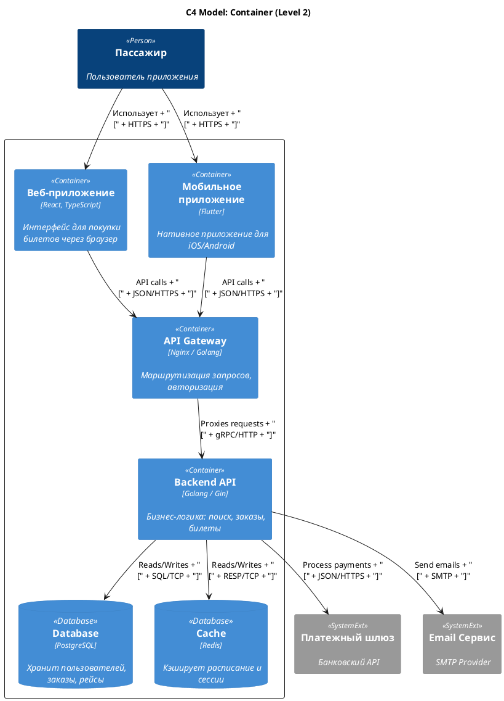
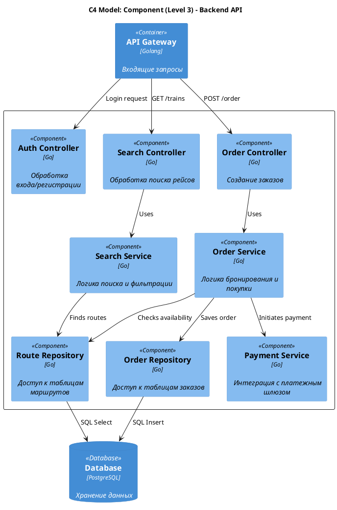

# Лабораторная работа №3. Задание 4: C4 Model

**Цель:** Описание архитектуры системы с использованием подхода C4 Model.

Архитектура представлена на трех уровнях детализации:
1.  **Context:** Общий контекст системы и её связи с внешним миром.
2.  **Container:** Высокоуровневая техническая архитектура (приложения, БД).
3.  **Component:** Внутреннее устройство основного контейнера (Backend API).

---

## 1. System Context Diagram (Уровень 1)

Показывает "большую картину": кто пользуется системой и с какими внешними системами она интегрируется.

---

## 2. Container Diagram (Уровень 2)

Показывает, из каких технических блоков (контейнеров) состоит система и как они общаются.

---

## 3. Component Diagram (Уровень 3)

Детализирует структуру Backend API, показывая основные контроллеры, сервисы и репозитории.

