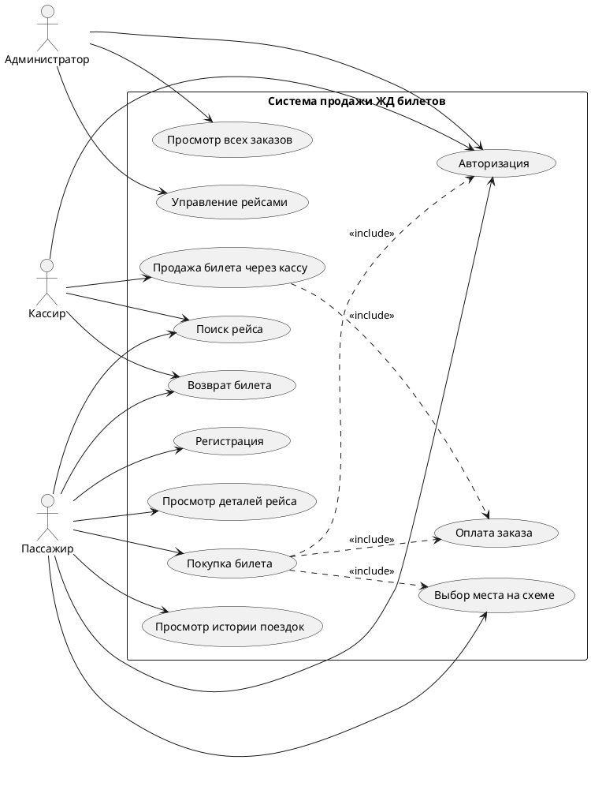

# Use Case Diagram

```puml
@startuml 01
left to right direction
actor "Пассажир" as Passenger
actor "Администратор" as Admin
actor "Кассир" as Cashier

rectangle "Система продажи ЖД билетов" {
  usecase "Регистрация" as UC1
  usecase "Авторизация" as UC2
  usecase "Поиск рейса" as UC3
  usecase "Просмотр деталей рейса" as UC4
  usecase "Выбор места на схеме" as UC5
  usecase "Покупка билета" as UC6
  usecase "Оплата заказа" as UC7
  usecase "Просмотр истории поездок" as UC8
  usecase "Управление рейсами" as UC9
  usecase "Просмотр всех заказов" as UC10
  usecase "Продажа билета через кассу" as UC11
  usecase "Возврат билета" as UC12
}

Passenger --> UC1
Passenger --> UC2
Passenger --> UC3
Passenger --> UC4
Passenger --> UC5
Passenger --> UC6
Passenger --> UC8
Passenger --> UC12

UC6 ..> UC7 : <<include>>
UC6 ..> UC5 : <<include>>
UC6 ..> UC2 : <<include>>

Admin --> UC2
Admin --> UC9
Admin --> UC10

Cashier --> UC2
Cashier --> UC3
Cashier --> UC11
Cashier --> UC12

UC11 ..> UC7 : <<include>>
@enduml
```
