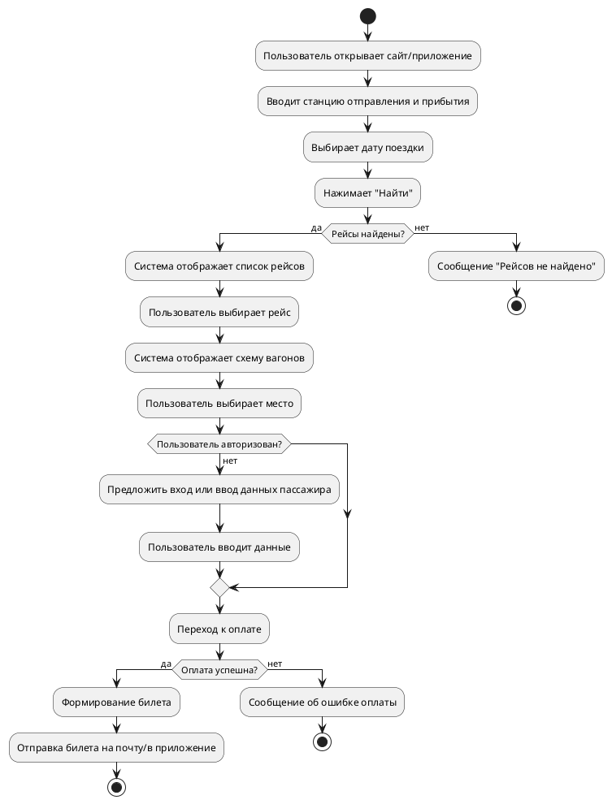

# Activity: Purchase Process

```puml
@startuml
start
:Пользователь открывает сайт/приложение;
:Вводит станцию отправления и прибытия;
:Выбирает дату поездки;
:Нажимает "Найти";
if (Рейсы найдены?) then (да)
  :Система отображает список рейсов;
  :Пользователь выбирает рейс;
  :Система отображает схему вагонов;
  :Пользователь выбирает место;
  if (Пользователь авторизован?) then (нет)
    :Предложить вход или ввод данных пассажира;
    :Пользователь вводит данные;
  endif
  :Переход к оплате;
  if (Оплата успешна?) then (да)
    :Формирование билета;
    :Отправка билета на почту/в приложение;
    stop
  else (нет)
    :Сообщение об ошибке оплаты;
    stop
  endif
else (нет)
  :Сообщение "Рейсов не найдено";
  stop
endif
@enduml
```
