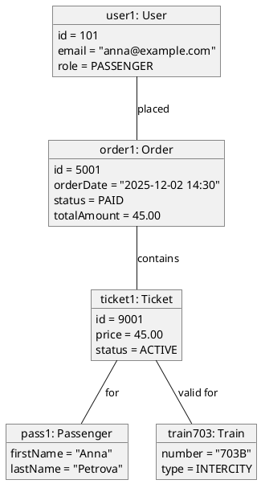

# Object Diagram

```puml
@startuml
object "user1: User" as u1 {
  id = 101
  email = "anna@example.com"
  role = PASSENGER
}

object "order1: Order" as o1 {
  id = 5001
  orderDate = "2025-12-02 14:30"
  status = PAID
  totalAmount = 45.00
}

object "ticket1: Ticket" as t1 {
  id = 9001
  price = 45.00
  status = ACTIVE
}

object "pass1: Passenger" as p1 {
  firstName = "Anna"
  lastName = "Petrova"
}

object "train703: Train" as tr1 {
  number = "703B"
  type = INTERCITY
}

u1 -- o1 : placed
o1 -- t1 : contains
t1 -- p1 : for
t1 -- tr1 : valid for
@enduml
```
