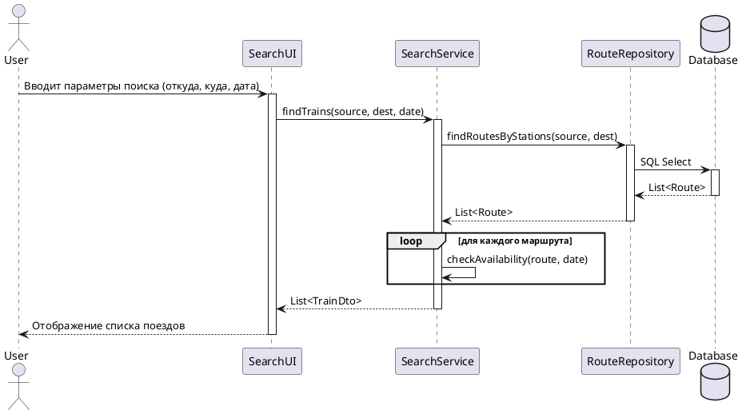

# Sequence: Search

```puml
@startuml
actor User
participant "SearchUI" as UI
participant "SearchService" as Service
participant "RouteRepository" as Repo
database "Database" as DB

User -> UI : Вводит параметры поиска (откуда, куда, дата)
activate UI
UI -> Service : findTrains(source, dest, date)
activate Service
Service -> Repo : findRoutesByStations(source, dest)
activate Repo
Repo -> DB : SQL Select
activate DB
DB --> Repo : List<Route>
deactivate DB
Repo --> Service : List<Route>
deactivate Repo

loop для каждого маршрута
    Service -> Service : checkAvailability(route, date)
end

Service --> UI : List<TrainDto>
deactivate Service
UI --> User : Отображение списка поездов
deactivate UI
@enduml
```
