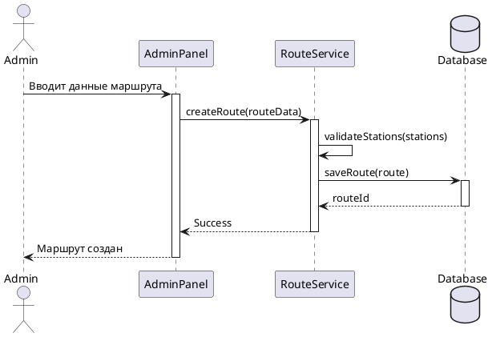

# Sequence: Admin Add Route

```puml
@startuml
actor Admin
participant "AdminPanel" as UI
participant "RouteService" as Service
database "Database" as DB

Admin -> UI : Вводит данные маршрута
activate UI
UI -> Service : createRoute(routeData)
activate Service
Service -> Service : validateStations(stations)
Service -> DB : saveRoute(route)
activate DB
DB --> Service : routeId
deactivate DB
Service --> UI : Success
deactivate Service
UI --> Admin : Маршрут создан
deactivate UI
@enduml
```
