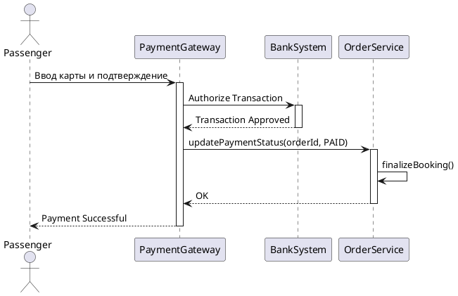

# Sequence: Payment

```puml
@startuml
actor Passenger
participant "PaymentGateway" as GW
participant "BankSystem" as Bank
participant "OrderService" as Order

Passenger -> GW : Ввод карты и подтверждение
activate GW
GW -> Bank : Authorize Transaction
activate Bank
Bank --> GW : Transaction Approved
deactivate Bank

GW -> Order : updatePaymentStatus(orderId, PAID)
activate Order
Order -> Order : finalizeBooking()
Order --> GW : OK
deactivate Order

GW --> Passenger : Payment Successful
deactivate GW
@enduml
```
