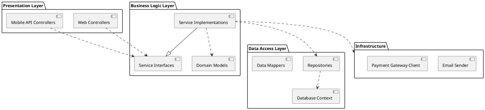

# Package Diagram

```puml
@startuml
package "Presentation Layer" {
  [Web Controllers]
  [Mobile API Controllers]
}

package "Business Logic Layer" {
  [Service Interfaces]
  [Service Implementations]
  [Domain Models]
}

package "Data Access Layer" {
  [Repositories]
  [Data Mappers]
  [Database Context]
}

package "Infrastructure" {
  [Email Sender]
  [Payment Gateway Client]
}

[Web Controllers] ..> [Service Interfaces]
[Mobile API Controllers] ..> [Service Interfaces]
[Service Implementations] --|> [Service Interfaces]
[Service Implementations] ..> [Domain Models]
[Service Implementations] ..> [Repositories]
[Repositories] ..> [Database Context]
[Service Implementations] ..> [Infrastructure]
@enduml
```
