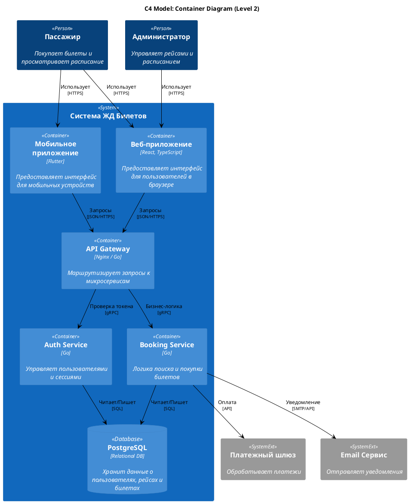

# C4: Container

```puml
@startuml
' C4_Custom.puml - Simplified C4 Model macros for reliable rendering
!define C4_PERSON_BG_COLOR #08427B
!define C4_SYSTEM_BG_COLOR #1168BD
!define C4_CONTAINER_BG_COLOR #438DD5
!define C4_COMPONENT_BG_COLOR #85BBF0
!define C4_EXTERNAL_BG_COLOR #999999

skinparam defaultTextAlignment center
skinparam wrapWidth 200
skinparam maxMessageSize 150

skinparam rectangle {
    StereotypeFontSize 12
    shadowing false
    FontColor #FFFFFF
}

skinparam arrow {
    Color #000000
    FontColor #000000
    FontSize 12
}

skinparam rectangle<<Person>> {
    BackgroundColor C4_PERSON_BG_COLOR
    BorderColor #073B6F
}

skinparam rectangle<<System>> {
    BackgroundColor C4_SYSTEM_BG_COLOR
    BorderColor #3C7FC0
}

skinparam rectangle<<SystemExt>> {
    BackgroundColor C4_EXTERNAL_BG_COLOR
    BorderColor #8A8A8A
}

skinparam rectangle<<Container>> {
    BackgroundColor C4_CONTAINER_BG_COLOR
    BorderColor #3C7FC0
}

skinparam rectangle<<Component>> {
    BackgroundColor C4_COMPONENT_BG_COLOR
    BorderColor #78A8D8
    FontColor #000000
}

skinparam database<<Database>> {
    BackgroundColor C4_CONTAINER_BG_COLOR
    BorderColor #3C7FC0
    FontColor #FFFFFF
}

!define Person(alias, label, desc="") rectangle "==label\n\n //desc//" as alias <<Person>>
!define System(alias, label, desc="") rectangle "==label\n\n //desc//" as alias <<System>>
!define System_Ext(alias, label, desc="") rectangle "==label\n\n //desc//" as alias <<SystemExt>>

!define System_Boundary(alias, label) rectangle "==label" as alias <<System>>

!define Container(alias, label, tech, desc="") rectangle "==label\n//<size:12>[tech]</size>//\n\n //desc//" as alias <<Container>>
!define ContainerDb(alias, label, tech, desc="") database "==label\n//<size:12>[tech]</size>//\n\n //desc//" as alias <<Database>>

!define Component(alias, label, tech, desc="") rectangle "==label\n//<size:12>[tech]</size>//\n\n //desc//" as alias <<Component>>

' Rel with optional technology parameter
!define Rel(from, to, label, tech="") from --> to : label\n<size:10>[tech]</size>

!define Rel_D(from, to, label, tech="") from -down-> to : label\n<size:10>[tech]</size>
!define Rel_R(from, to, label, tech="") from -right-> to : label\n<size:10>[tech]</size>
!define Rel_L(from, to, label, tech="") from -left-> to : label\n<size:10>[tech]</size>
!define Rel_U(from, to, label, tech="") from -up-> to : label\n<size:10>[tech]</size>

hide stereo

title C4 Model: Container Diagram (Level 2)

Person(passenger, "Пассажир", "Покупает билеты и просматривает расписание")
Person(admin, "Администратор", "Управляет рейсами и расписанием")

System_Boundary(ticket_system_boundary, "Система ЖД Билетов") {
    Container(web_app, "Веб-приложение", "React, TypeScript", "Предоставляет интерфейс для пользователей в браузере")
    Container(mobile_app, "Мобильное приложение", "Flutter", "Предоставляет интерфейс для мобильных устройств")
    Container(api_gateway, "API Gateway", "Nginx / Go", "Маршрутизирует запросы к микросервисам")
    
    Container(auth_service, "Auth Service", "Go", "Управляет пользователями и сессиями")
    Container(booking_service, "Booking Service", "Go", "Логика поиска и покупки билетов")
    
    ContainerDb(db, "PostgreSQL", "Relational DB", "Хранит данные о пользователях, рейсах и билетах")
}

System_Ext(payment_gateway, "Платежный шлюз", "Обрабатывает платежи")
System_Ext(email_system, "Email Сервис", "Отправляет уведомления")

Rel(passenger, web_app, "Использует", "HTTPS")
Rel(passenger, mobile_app, "Использует", "HTTPS")
Rel(admin, web_app, "Использует", "HTTPS")

Rel(web_app, api_gateway, "Запросы", "JSON/HTTPS")
Rel(mobile_app, api_gateway, "Запросы", "JSON/HTTPS")

Rel(api_gateway, auth_service, "Проверка токена", "gRPC")
Rel(api_gateway, booking_service, "Бизнес-логика", "gRPC")

Rel(auth_service, db, "Читает/Пишет", "SQL")
Rel(booking_service, db, "Читает/Пишет", "SQL")

Rel(booking_service, payment_gateway, "Оплата", "API")
Rel(booking_service, email_system, "Уведомление", "SMTP/API")

@enduml
```
