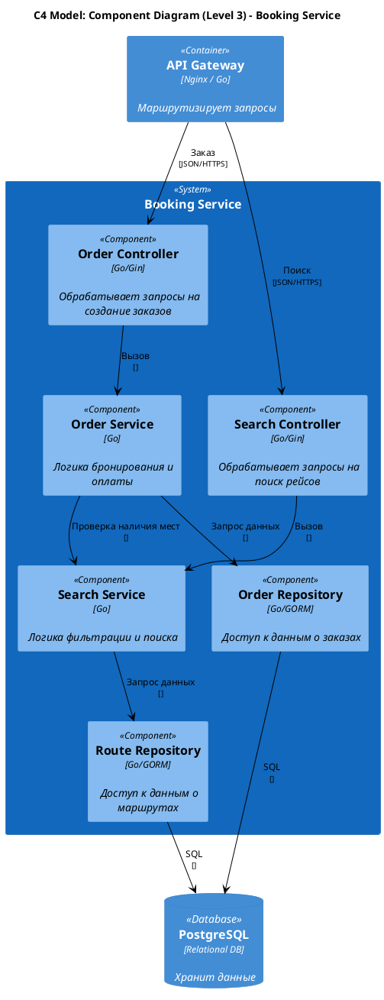

# C4: Component

```puml
@startuml
' C4_Custom.puml - Simplified C4 Model macros for reliable rendering
!define C4_PERSON_BG_COLOR #08427B
!define C4_SYSTEM_BG_COLOR #1168BD
!define C4_CONTAINER_BG_COLOR #438DD5
!define C4_COMPONENT_BG_COLOR #85BBF0
!define C4_EXTERNAL_BG_COLOR #999999

skinparam defaultTextAlignment center
skinparam wrapWidth 200
skinparam maxMessageSize 150

skinparam rectangle {
    StereotypeFontSize 12
    shadowing false
    FontColor #FFFFFF
}

skinparam arrow {
    Color #000000
    FontColor #000000
    FontSize 12
}

skinparam rectangle<<Person>> {
    BackgroundColor C4_PERSON_BG_COLOR
    BorderColor #073B6F
}

skinparam rectangle<<System>> {
    BackgroundColor C4_SYSTEM_BG_COLOR
    BorderColor #3C7FC0
}

skinparam rectangle<<SystemExt>> {
    BackgroundColor C4_EXTERNAL_BG_COLOR
    BorderColor #8A8A8A
}

skinparam rectangle<<Container>> {
    BackgroundColor C4_CONTAINER_BG_COLOR
    BorderColor #3C7FC0
}

skinparam rectangle<<Component>> {
    BackgroundColor C4_COMPONENT_BG_COLOR
    BorderColor #78A8D8
    FontColor #000000
}

skinparam database<<Database>> {
    BackgroundColor C4_CONTAINER_BG_COLOR
    BorderColor #3C7FC0
    FontColor #FFFFFF
}

!define Person(alias, label, desc="") rectangle "==label\n\n //desc//" as alias <<Person>>
!define System(alias, label, desc="") rectangle "==label\n\n //desc//" as alias <<System>>
!define System_Ext(alias, label, desc="") rectangle "==label\n\n //desc//" as alias <<SystemExt>>

!define System_Boundary(alias, label) rectangle "==label" as alias <<System>>

!define Container(alias, label, tech, desc="") rectangle "==label\n//<size:12>[tech]</size>//\n\n //desc//" as alias <<Container>>
!define ContainerDb(alias, label, tech, desc="") database "==label\n//<size:12>[tech]</size>//\n\n //desc//" as alias <<Database>>

!define Component(alias, label, tech, desc="") rectangle "==label\n//<size:12>[tech]</size>//\n\n //desc//" as alias <<Component>>

' Rel with optional technology parameter
!define Rel(from, to, label, tech="") from --> to : label\n<size:10>[tech]</size>

!define Rel_D(from, to, label, tech="") from -down-> to : label\n<size:10>[tech]</size>
!define Rel_R(from, to, label, tech="") from -right-> to : label\n<size:10>[tech]</size>
!define Rel_L(from, to, label, tech="") from -left-> to : label\n<size:10>[tech]</size>
!define Rel_U(from, to, label, tech="") from -up-> to : label\n<size:10>[tech]</size>

hide stereo

title C4 Model: Component Diagram (Level 3) - Booking Service

Container(api_gateway, "API Gateway", "Nginx / Go", "Маршрутизирует запросы")

System_Boundary(booking_svc_boundary, "Booking Service") {
    Component(search_controller, "Search Controller", "Go/Gin", "Обрабатывает запросы на поиск рейсов")
    Component(order_controller, "Order Controller", "Go/Gin", "Обрабатывает запросы на создание заказов")
    
    Component(search_service, "Search Service", "Go", "Логика фильтрации и поиска")
    Component(order_service, "Order Service", "Go", "Логика бронирования и оплаты")
    
    Component(route_repo, "Route Repository", "Go/GORM", "Доступ к данным о маршрутах")
    Component(order_repo, "Order Repository", "Go/GORM", "Доступ к данным о заказах")
}

ContainerDb(db, "PostgreSQL", "Relational DB", "Хранит данные")

Rel(api_gateway, search_controller, "Поиск", "JSON/HTTPS")
Rel(api_gateway, order_controller, "Заказ", "JSON/HTTPS")

Rel(search_controller, search_service, "Вызов")
Rel(order_controller, order_service, "Вызов")

Rel(search_service, route_repo, "Запрос данных")
Rel(order_service, order_repo, "Запрос данных")
Rel(order_service, search_service, "Проверка наличия мест")

Rel(route_repo, db, "SQL")
Rel(order_repo, db, "SQL")

@enduml
```
