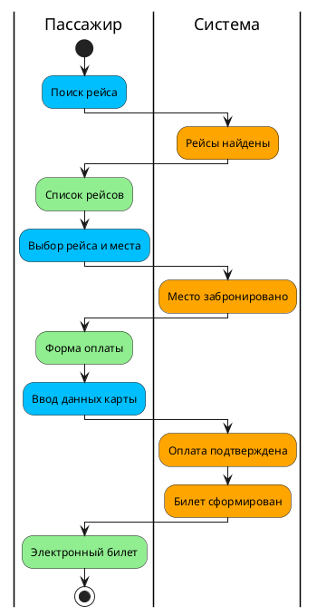

# Event Modeling: Ticket Purchase

```puml
@startuml
' EventModeling.puml - Custom implementation based on Activity Diagram notation
!define EM_EVENT_COLOR #Orange
!define EM_COMMAND_COLOR #DeepSkyBlue
!define EM_VIEW_COLOR #LightGreen

skinparam defaultTextAlignment center
skinparam wrapWidth 200
skinparam maxMessageSize 150

skinparam activity {
    FontSize 12
}

' Define macros for Activity Diagram syntax
!define Event(label) #Orange:label;
!define Command(label) #DeepSkyBlue:label;
!define View(label) #LightGreen:label;

|Пассажир|
start
Command(Поиск рейса)
|Система|
Event(Рейсы найдены)
|Пассажир|
View(Список рейсов)
Command(Выбор рейса и места)
|Система|
Event(Место забронировано)
|Пассажир|
View(Форма оплаты)
Command(Ввод данных карты)
|Система|
Event(Оплата подтверждена)
Event(Билет сформирован)
|Пассажир|
View(Электронный билет)
stop
@enduml
```
