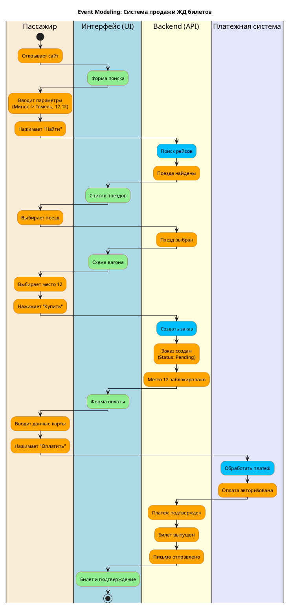

# Лабораторная работа №3. Задание 3: Event Modeling

**Цель:** Проектирование системы "ЖД Вокзал" с использованием метода Event Modeling.

Этот метод фокусируется на том, как информация изменяется во времени через события, связывая интерфейс (Views), действия пользователя (Commands) и системные события (Events).

---

## Описание модели

Диаграмма описывает сквозной процесс покупки билета, показывая взаимодействие между:
*   **Пассажиром** (пользователем)
*   **Интерфейсом** (UI/Views)
*   **Бэкендом** (Commands & Events)
*   **Внешней системой** (Платежный шлюз)

### Легенда
*   **View (Зеленый):** То, что видит пользователь (Экран, Форма).
*   **Command (Синий):** Действие, меняющее состояние системы (Нажатие кнопки, API запрос).
*   **Event (Оранжевый):** Фактическое событие, произошедшее в системе (Состояние изменилось).

---

## Диаграмма: Покупка билета

