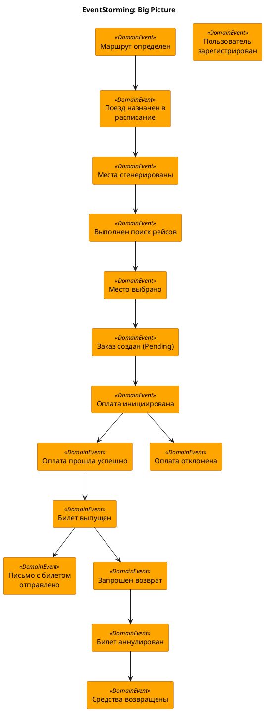
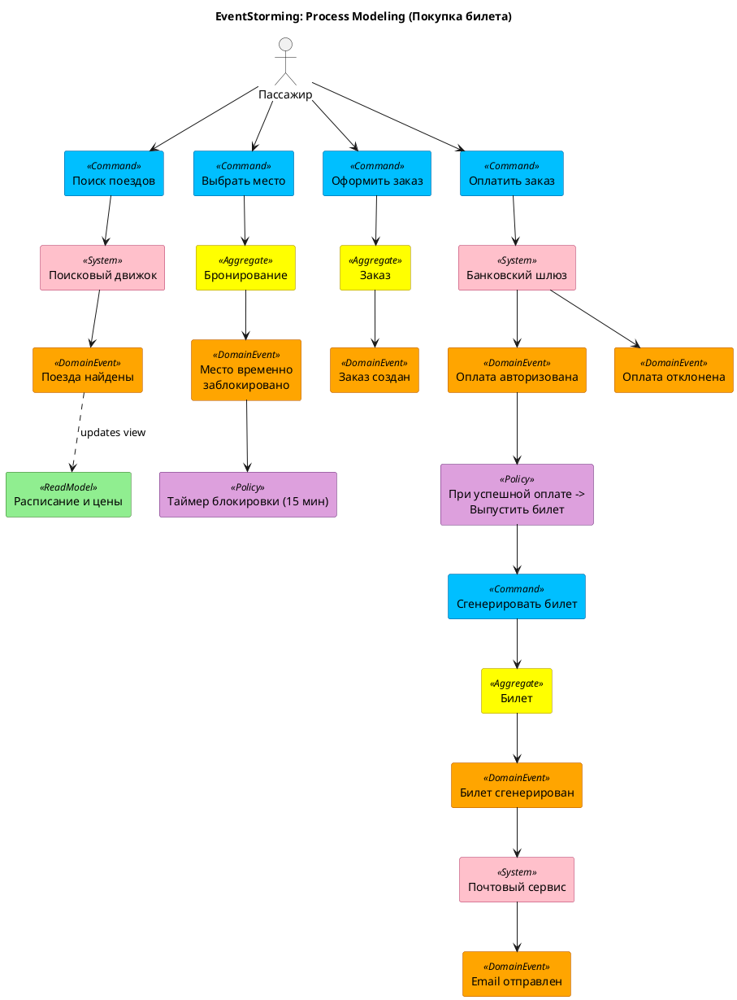
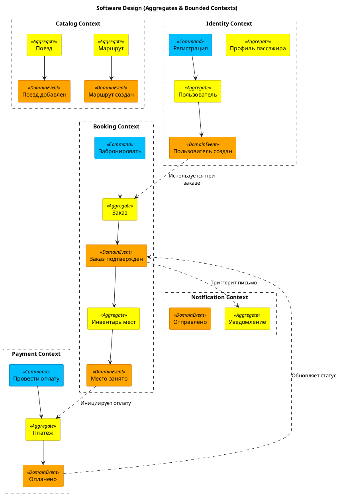

# Лабораторная работа №3. Задание 2: EventStorming

**Цель:** Проектирование системы "ЖД Вокзал" с использованием метода EventStorming (Исследование событий).

---

## 1. Big Picture (Крупномасштабное исследование)

На этом уровне мы исследуем предметную область, выстраивая хронологическую цепочку событий (Domain Events). Мы определяем, "что происходит" в системе, не углубляясь в детали реализации.

**Основные потоки событий:**
1.  **Администрирование:** Создание маршрутов и расписаний.
2.  **Покупка:** Поиск -> Выбор -> Бронь -> Оплата -> Билет.
3.  **Возврат:** Отмена билета -> Возврат денег.

---

## 2. Process Modeling (Моделирование процесса)

На этом этапе мы детализируем бизнес-процессы, добавляя:
*   **Команды (Commands):** Действия, инициируемые пользователем или системой.
*   **Акторы (Actors):** Кто выполняет команды.
*   **Системы (Systems):** Внешние сервисы или внутренние модули.
*   **Политики (Policies):** Бизнес-правила (реакция на события).
*   **Модели чтения (Read Models):** Данные, необходимые для принятия решений.

**Ключевой процесс: Покупка билета**

---

## 3. Software Design (Проектирование архитектуры)

Группировка агрегатов и событий в Ограниченные Контексты (Bounded Contexts) для построения микросервисной архитектуры.

**Выделенные контексты:**
1.  **Catalog Context:** Управление расписанием, поездами, маршрутами.
2.  **Booking Context:** Управление заказами, резервация мест.
3.  **Identity Context:** Пользователи, профили пассажиров.
4.  **Payment Context:** Обработка транзакций.
5.  **Notification Context:** Рассылка уведомлений.

