# Спецификация системы "ЖД Вокзал Минск" (Лабораторная работа №3)

**Цель:** Разработать спецификацию системы с использованием языка моделирования PlantUML.

---

## 1. Диаграмма вариантов использования (Use Case Diagram)

Диаграмма описывает основные функциональные возможности системы и взаимодействия с действующими лицами (акторами).

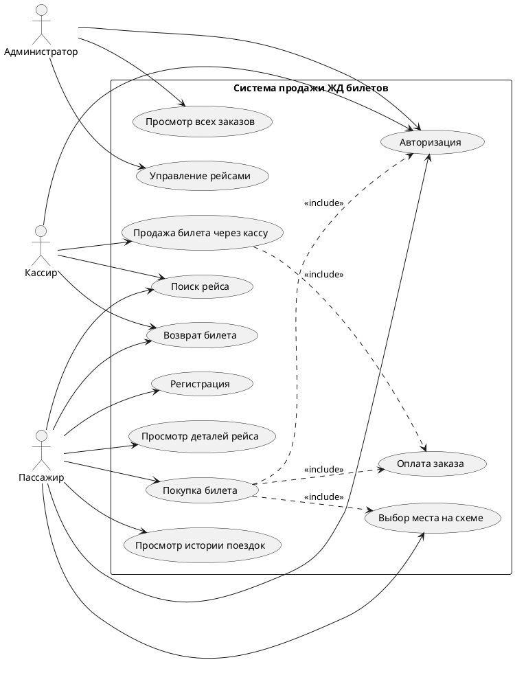

### Акторы
*   **Пассажир**: Пользователь, желающий найти и купить билет.
*   **Администратор**: Сотрудник, управляющий данными системы (рейсы, пользователи).
*   **Кассир**: Сотрудник, оформляющий билеты на вокзале.

### Сценарии вариантов использования

#### Сценарий 1: Покупка билета (Основной)
**Название:** Покупка билета онлайн.
**Действующее лицо:** Пассажир.
**Предусловие:** Пассажир находится на сайте/в приложении.
**Постусловие:** Билет куплен, отправлен на почту, место в вагоне занято.

**Основной поток:**
1.  Пассажир выбирает вариант использования "Поиск рейса".
2.  Система отображает форму поиска.
3.  Пассажир вводит станцию отправления, назначения и дату.
4.  Система отображает список доступных поездов.
5.  Пассажир выбирает подходящий поезд.
6.  Система отображает схему вагонов (ВИ "Выбор места на схеме").
7.  Пассажир выбирает свободное место.
8.  Система запрашивает подтверждение и переход к оплате.
9.  Пассажир подтверждает выбор.
10. Если пользователь не авторизован, Система запрашивает вход (ВИ "Авторизация").
11. Пассажир переходит к оплате (ВИ "Оплата заказа").
12. Система подтверждает успешную транзакцию.
13. Система генерирует билет и отправляет его пользователю.

**Альтернативный поток (Нет мест):**
4а. Система сообщает, что билетов на выбранную дату нет.
4б. Сценарий завершается или возвращается к шагу 3.

#### Сценарий 2: Добавление рейса
**Название:** Добавление нового железнодорожного рейса.
**Действующее лицо:** Администратор.
**Предусловие:** Администратор авторизован в системе.

**Основной поток:**
1.  Администратор выбирает раздел "Управление рейсами".
2.  Система отображает список текущих рейсов.
3.  Администратор нажимает "Добавить рейс".
4.  Система отображает форму создания рейса.
5.  Администратор вводит номер поезда, тип, маршрут следования.
6.  Система проверяет корректность данных.
7.  Система сохраняет новый рейс в базе данных.
8.  Система выводит сообщение об успехе.

#### Сценарий 3: Возврат билета
**Название:** Оформление возврата билета.
**Действующее лицо:** Пассажир.
**Предусловие:** У пассажира есть купленный билет, до отправления более 1 часа.

**Основной поток:**
1.  Пассажир заходит в "Личный кабинет" -> "История поездок".
2.  Система отображает список билетов.
3.  Пассажир выбирает активный билет и нажимает "Вернуть".
4.  Система рассчитывает сумму возврата (с учетом комиссий).
5.  Пассажир подтверждает возврат.
6.  Система меняет статус билета на "Возвращен".
7.  Система инициирует возврат средств на карту.
8.  Место в вагоне снова становится свободным.

---

## 2. Диаграммы деятельности (Activity Diagrams)

### 2.1. Процесс покупки билета
Диаграмма детализирует алгоритм покупки билета пользователем, включая ветвления при ошибках или отсутствии мест.

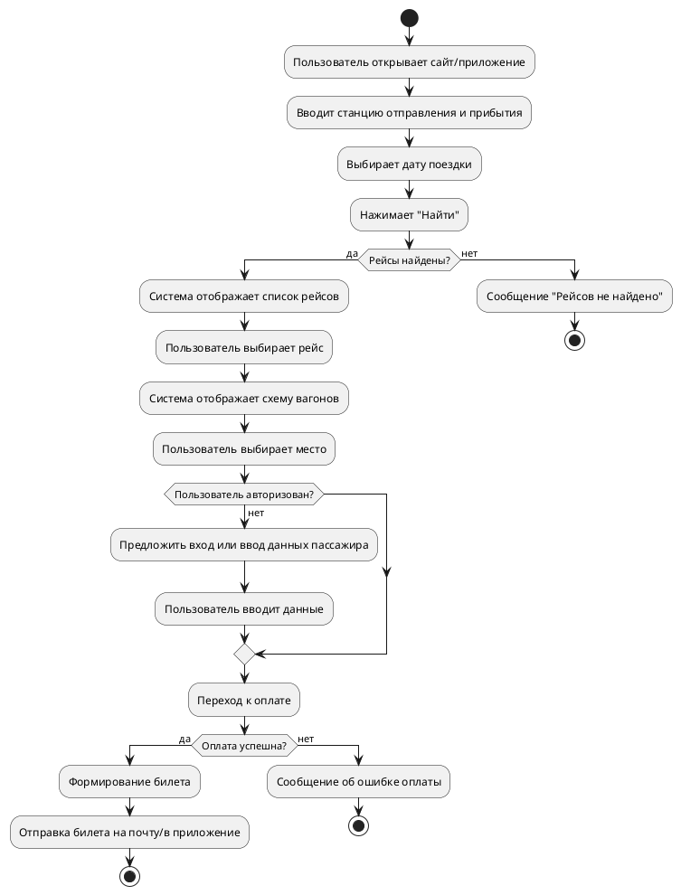

### 2.2. Процесс добавления маршрута
Диаграмма описывает последовательность действий администратора при вводе нового рейса в систему.

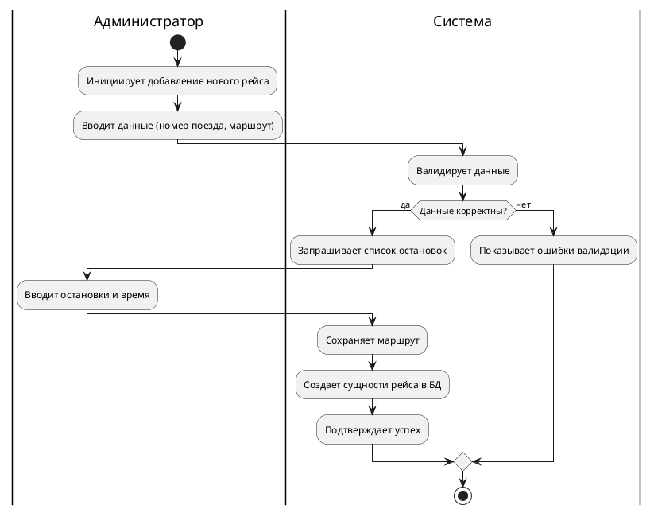

---

## 3. Диаграмма классов (Class Diagram)

Отображает статическую структуру системы, основные сущности (User, Ticket, Train, Route) и связи между ними (ассоциации, композиции).

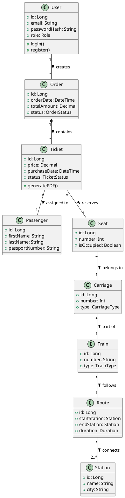

### 3.1. Диаграмма объектов
Показывает пример конкретного экземпляра выполнения системы (снапшот): пользователь Анна оформила заказ №5001 с одним билетом.

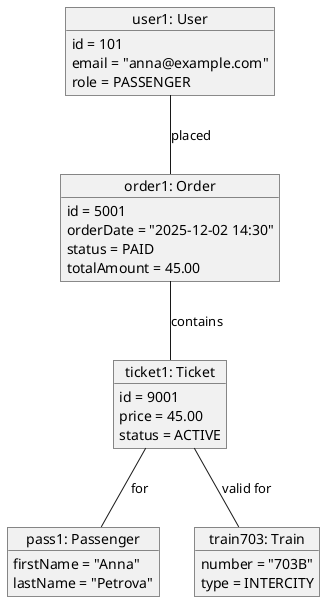

**Описание классов:**
*   **User**: Базовый класс пользователя.
*   **Passenger**: Информация о конкретном пассажире (ФИО, паспорт).
*   **Order**: Заказ, который может содержать несколько билетов.
*   **Ticket**: Единица права на проезд, связана с конкретным местом.
*   **Train/Carriage/Seat**: Иерархия физических объектов (Поезд -> Вагон -> Место).

---

## 4. Диаграммы последовательности (Sequence Diagrams)

Описывают взаимодействие объектов во времени для реализации конкретных сценариев.

### 4.1. Поиск рейса
Показывает взаимодействие UI, Сервиса поиска и Репозитория маршрутов.

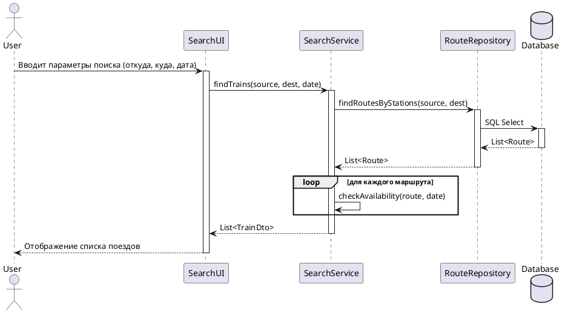

### 4.2. Покупка билета
Детальный поток обмена сообщениями между UI, Сервисом заказов, Платежным шлюзом и Сервисом уведомлений.

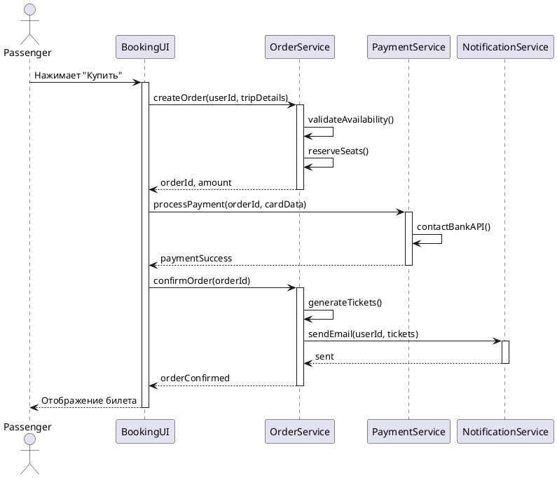

### 4.3. Авторизация
Процесс входа пользователя в систему.

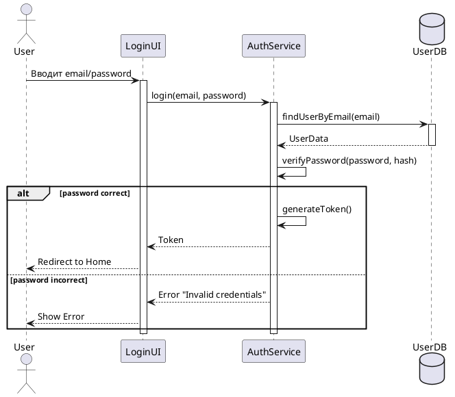

### 4.4. Добавление рейса (Админ)
Взаимодействие администратора с панелью управления и базой данных.

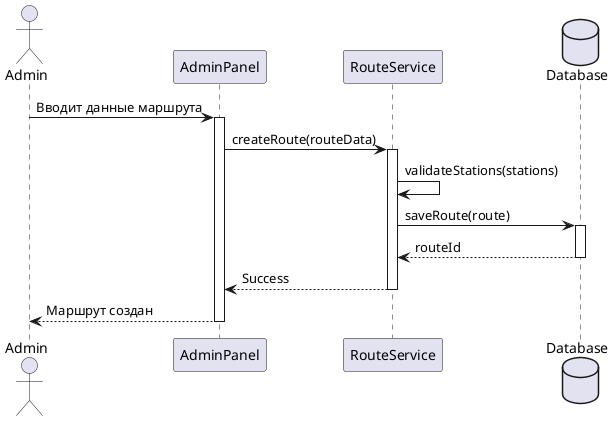

### 4.5. Обработка платежа
Интеграция с внешней банковской системой.

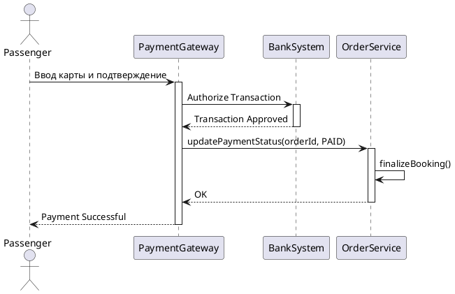

---

## 5. Диаграмма компонентов (Component Diagram)

Показывает разделение системы на физические и логические компоненты (Веб-приложение, API, Микросервисы, БД).

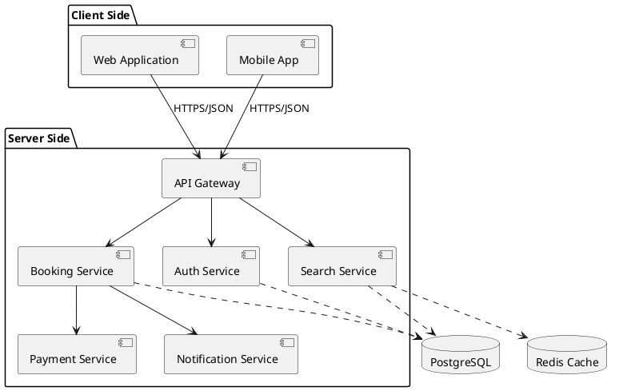

---

## 6. Диаграмма пакетов (Package Diagram)

Организация исходного кода системы по слоям (Presentation, Business Logic, Data Access).

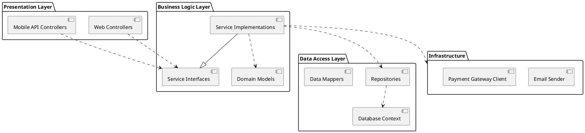

---

## 7. Диаграмма развертывания (Deployment Diagram)

Схема размещения программных компонентов на аппаратных узлах (Клиент, Сервер приложений, Сервер БД, Балансировщик).

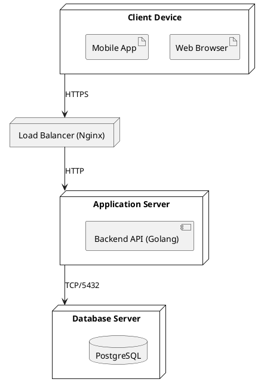

---

## 8. Схема базы данных (ERD)

Диаграмма сущность-связь, описывающая таблицы базы данных и отношения внешних ключей.

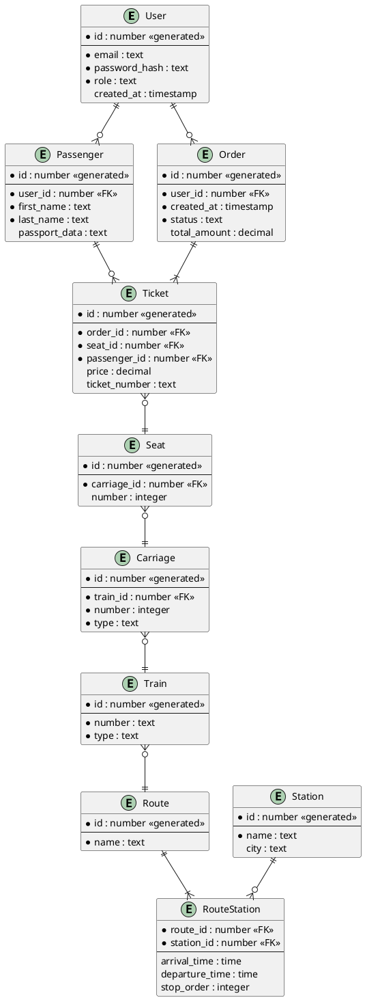
